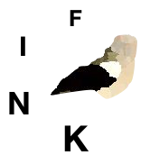

 

 

# 

Fink is a broker infrastructure using Apache Spark Streaming to receive and process alerts issued from telescopes all over the world.

## Rationale

The design of Fink is driven by three pillars:

* **Simplicity** the broker should be simple enough to be used by a majority of scientists and maintained in real-time. This means the exposed API must be easily understood by anyone, and the code base should be as small as possible to allow easy maintenance and upgrade.
* **Scalability** the broker's behaviour should be the same regardless the amount of incoming data. This implies the technology used for this is scalable.
* **Flexibility** the broker structure should allow for easy extension. As data will come, new features will be added, and the broker should be able to incorporate those smoothly. In addition, the broker should be able to connect to a large numbers of external tools and frameworks to maximize its scientific production without redeveloping tools.

Fink core is based on the [Apache Spark](http://spark.apache.org/) framework, and more specifically its [streaming module](http://spark.apache.org/streaming/). The language chosen for the API is Python, which is widely used in the astronomy community, has a large scientific ecosystem and easily connects with existing tools.

## Documentation

Fink's documentation (WIP) is hosted [here](fink-broker.rtfd.io).
