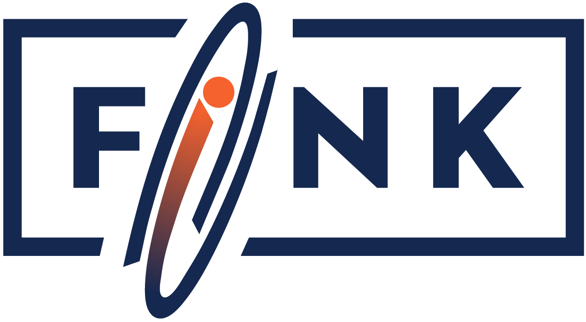

# 

[Fink](https://fink-broker.org) is a broker infrastructure enabling a wide range of applications and services to connect to large streams of alerts issued from telescopes all over the world. You can check the white paper at https://doi.org/10.1093/mnras/staa3602.

# Latest News

* 01/22: Release [1.4](https://github.com/astrolabsoftware/fink-broker/pull/518)
* 11/21: Release [1.3](https://github.com/astrolabsoftware/fink-broker/pull/495)
* 11/21: Release [1.2](https://github.com/astrolabsoftware/fink-broker/pull/492)
* 08/21: Fink selected as [Rubin Observatory Alert Broker](https://www.lsst.org/scientists/alert-brokers).
* 03/21: Release [1.1](https://github.com/astrolabsoftware/fink-broker/pull/429)
* 02/21: Release [1.0](https://github.com/astrolabsoftware/fink-broker/pull/416)
* 08/20: Release [0.7](https://github.com/astrolabsoftware/fink-broker/pull/396)
* 06/20: Release [0.6](https://github.com/astrolabsoftware/fink-broker/pull/386).
* 05/20: Fink has been selected to the Google Summer of Code 2020 (CERN-HSF org)! Congratulations to [saucam](https://github.com/saucam) who will work on the project this year.
* 04/20: New broker release [0.5](https://github.com/astrolabsoftware/fink-broker/pull/354). Plenty of new features!
* 02/20: Fink signed a MoU with [ZTF](https://www.ztf.caltech.edu/) to access their live streams!
* 10/19: Fink was featured at the Spark+AI Summit Europe 2019.
* 06/19: Fink is participating to the LSST [call](https://ldm-682.lsst.io/) for community broker.
* 05/19: Fink has been selected to the Google Summer of Code 2019 (CERN-HSF org)! Congratulations to [cAbhi15](https://github.com/cAbhi15) who will work on the project this year.

## Getting started

Learning Fink is easy whether you are a developer or a scientist:

* Learn about the [broker technology](https://fink-broker.readthedocs.io/en/latest/broker/introduction/), the [science](https://fink-broker.readthedocs.io/en/latest/science/introduction/) we do, and how to [receive](https://fink-broker.readthedocs.io/en/latest/fink-client/) alerts.
* Learn how to use the broker or how to contribute following the different [tutorials](https://fink-broker.readthedocs.io/en/latest/tutorials/introduction/).
* Explore the different components:
    * [fink-alert-simulator](https://github.com/astrolabsoftware/fink-alert-simulator): Simulate alert streams for the Fink broker.
    * [fink-broker](https://github.com/astrolabsoftware/fink-broker): Astronomy Broker based on Apache Spark.
    * [fink-science](https://github.com/astrolabsoftware/fink-science): Define your science modules to add values to Fink alerts.
    * [fink-filters](https://github.com/astrolabsoftware/fink-filters): Define your filters to create your alert stream in Fink.
    * [fink-client](https://github.com/astrolabsoftware/fink-client):  Light-weight client to manipulate alerts from Fink.

## Documentation

Fink's documentation is hosted [here](https://fink-broker.rtfd.io).

## Science Portal

You can explore all Fink data at [https://fink-portal.org](https://fink-portal.org).
