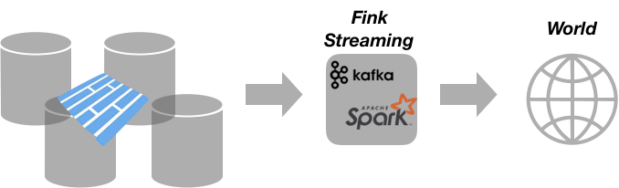

# Available Fink services

<script src="http://ajax.googleapis.com/ajax/libs/jquery/1.8.2/jquery.min.js"></script>
<script src="https://code.highcharts.com/highcharts.js"></script>
<script src="https://code.highcharts.com/modules/data.js"></script>
<script src="https://code.highcharts.com/highcharts-more.js"></script>
<script src="https://code.highcharts.com/modules/exporting.js"></script>

In addition to [archiving](database.md) the streams, Fink provides built-in services operating at different levels:

- Operating from the stream or from the database
- Real time or post-processing of alerts.
- Urgent decision to take (observation plan).


Given the crazy rate of alerts, it seems insane to live monitor each alert individually, and on short timescales it makes more sense to focus on some physically motivated statistics on the stream, target potential outliers, and highlight problems. On longer timescales, we want of course also to be able to access, inspect, and process each alert received by Fink. Each service is typically a Spark job on the database (to avoid putting too high load on the alert sender), but the archive service that operates directly on the stream.

Each Spark job is either batch or streaming, or both (multi-modal analytics). All services are linked to the [dashboard](dashboard.md), and you can easily follow live and interactively the outputs. To start a service, just execute:

```bash
./fink start <service_name> > output.log &
```

For convenience, we redirect the console output to a log file, and escape. You can also use tools like `nohup`. To stop services, simply use:

```bash
./fink stop services
```

Note this will stop all Fink services running (this will change in the future to stop services individually). You can easily define your own service in Fink, and connect it to the alert database. See [Adding a new service](adding-new-service.md) for more information.

## Monitoring

The monitoring of the stream is typically done with the archiving service. But for test reasons, we sometimes also want to monitor the stream directly. The service will give you information on the incoming rate (number of alerts per second from Kafka), the processing rate (number of alerts per second received and processed by Spark), and the batch time (time to process a micro-batch of alerts).

To use this service, just execute:

```bash
./fink start monitoring > live.log &
```
Again, this will query the stream directly - so be careful!

<div id="container_live"></div>
<script src="../js/live.js"></script>

## Early classification

This service operates from the database and connects to external database such as the CDS Strasbourg, and perform real-time classification for known objects based on incoming alert positions on sky. The idea is to classify the alerts into 2 big classes: known objects vs unknown objects. And for known objects, we want to retrieve known information such as the name and type of the object. It is a standard problem of cross-match, but in real-time! In order to not rely on hard-coded catalogs, we will connect to remote databases, and query them with the data in our alerts (ra/dec-based). Fink uses the CDS [X-Match](http://cdsxmatch.u-strasbg.fr/) service, and the SIMBAD bibliographical database (updated each day). To start classifying the alerts from the database, just launch:

```bash
./fink start classify > classify.log &
```

and go to `http://localhost:5000/classification.html`

<!--  -->

<div id="container_bar"></div>
<script src="../js/bar.js"></script>

## Outlier detection (WIP)
Short timescale.

## Light-curve inspection (WIP)
Long timescale.

## Streaming out


