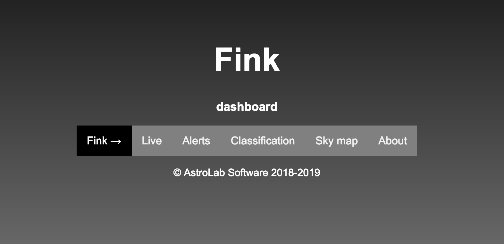
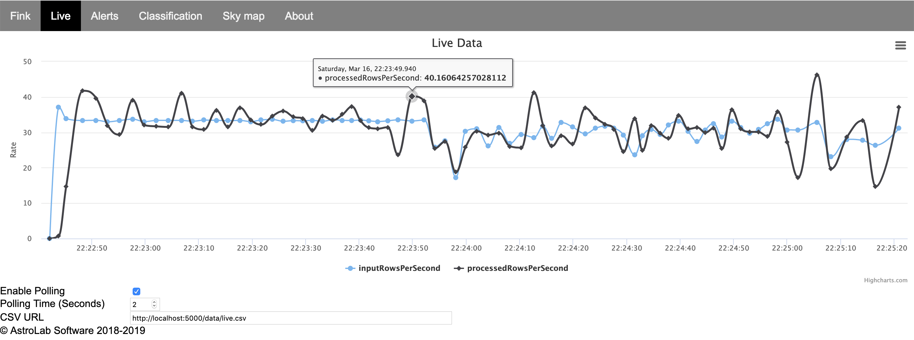
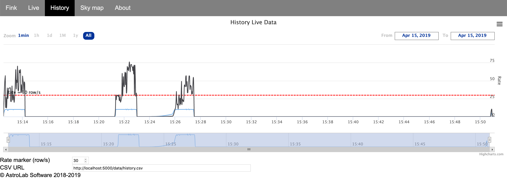

# Dashboard

## Why a dashboard?

Services typically process the data, and compress this large volume of information into a small number of summary outputs which are redirected to the dashboard. The role of the dashboard is to quickly visualise what is happening with the alerts, and help taking decisions.

## Structure of the dashboard

As of now, the dashboard is written in pure html and javascript, and it is mainly work in progress. It is run locally via a dockerized Web server application (Apache HTTP Server). In brief, services output periodically summary data in CSV, which are read by javascript scripts and processed using [Highcharts](https://www.highcharts.com). Most of data plots are interactive, and updated in real-time.

*I have no skills in web development, and the current structure is very limited (and ugly!)... Ideally the dashboard should be*

- *light (consuming few resources)*
- *secured*
- *with a solid backend and a nice frontend.*

*In addition it should be updated frequently with new data streaming in, and be able to access data in a distributed file system (e.g. HDFS).*

*Web developers, Fink needs you! If you have experience with web development (backend & frontend) do not hesitate to reach us! Ideally: Flask or Django for Python, Akka.http for Scala, ... Also expertise in webHDFS would be a plus!*

## How to use the dashboard

The dashboard is served using docker-compose, and use the port 5000 (you can change the port in the [Configuration](configuration.md)). Make sure you have the latest version of docker-compose (working as of early 2019). To start the dashboard, execute:
```bash
fink start dashboard
# Creating dashboardnet_website_1 ... done
# Dashboard served at http://localhost:5000
```

and go to [http://localhost:5000](http://localhost:5000):



Then you can click on the different [services](available-services.md), and see data live! Here is a screenshot of the live stream when archiving the stream:



And here is a screenshot of the history monitoring data stream:



Note that in the configuration file you can specify the folder hosting data for the dashboard:

```bash
# Default
FINK_UI_PATH=${FINK_HOME}/web/data
```

Note that since the dashboard is served using docker-compose, we mount (and keep it synchronised) by default the `$FINK_HOME/web` folder, containing `data`. Therefore if you choose a folder outside `web`, make sure it is mounted inside the docker container (see `docker-compose-ui.yml`).

## Extending the dashboard

Ideally all services are linked to the dashboard, and new services should include a part that outputs summary data to be plotted. Contact us if you would like to add your service to the dashboard, or if you already connected it and you want to share the code with the community!
