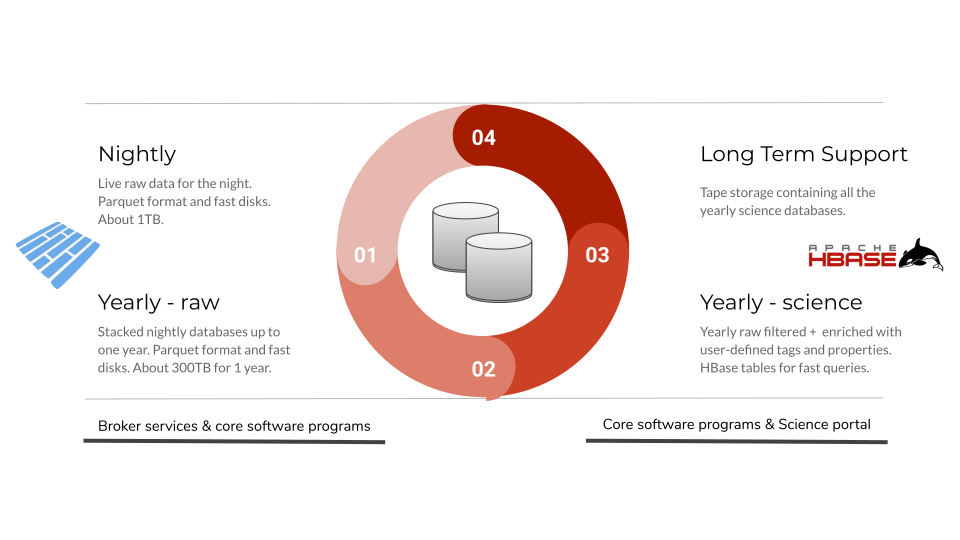

# Databases

## Why archiving first?

If we had all our jobs reading from the upstream Kafka cluster, we would consume too much resources, and place high load on Kafka. Hence the first service of Fink is to archive the incoming streams, as fast as possible. We start with one Spark Structured Streaming job reading and decoding Avro events from telescopes, and writing them to partitioned Parquet tables in distributed file systems such as HDFS (Raw database). Then multi-modal analytics take place and several other batch and streaming jobs query this table to process further the data, and push relevant alert data into an HBase table (Science database).

Why two different technologies instead of one? Long story short:

- Parquet is good for data scanning (processing)
- HBase is good for data lookup (querying)

In addition, HBase is schemaless (schema is stored with the record, not the table) allowing easily the user to update alert data with new labels as they come.



## Raw database structure

We currently operates the conversion from Avro (alerts) to Parquet (database) for mainly two reasons:

- Parquet is a built-in output sinks in Structured Streaming, not Avro. We can use a custom sink for Avro, but as Parquet is better integrated with the Spark ecosystem at this point, we stick to it for the moment.
- Other services (post-processing) integrates better with Parquet for the moment. Only the streaming out part would need re-conversion to Avro (Kafka style).

The archiving part is crucial, and must pass a number of stress tests (not exhaustive!):

- What happens if we lose some machines hosting the broker?
- What happens if there is a broker shutdown?
- What happens if there are sudden bursts of alerts?
- What happens if LSST starts to send alerts at a crazy sustained rate?

Extensive benchmarks and resources sizing are under study. The main Parquet database is stored in HDFS (fault-tolerant), and data are partitioned hourly by topic name (`topic/YYYY/MM/dd/hh`). To launch the archiving service, just use:

```bash
fink start stream2raw > stream2raw.log &
```

Just make sure you attached the `stream2raw` service to disks with large enough space! After the first alerts come, you will have something like:

```bash
# in $FINK_ALERT_PATH
_spark_metadata\
topic=ztf-stream-sim\
  year=2019\
    month=03\
      day=25\
        hour=09\
          part-00000-de57de35-7a77-49f3-af89-d7cbb4a6cd0c.c000.snappy.parquet
          ...
```


Note we perform a data compression (snappy). The compression factor will depend on the triggering time and incoming packet size, but is typically a factor of 1.5. To define the archiving location, see `conf/fink.conf`, or follow steps in [Configuration](configuration.md).

## Monitoring the data transfer

There is a monitoring service attached to the database construction. Unfortunately at the time of writing, there is no built-in listeners in pyspark (2.4) to monitor structured streaming queries. So we had to develop custom tools, and redirect information in the Fink [dashboard](dashboard.md). This is automatically done when you start the `stream2raw` service. Just launch the Fink dashboard and go to [live](http://localhost:5000/live.html) or [history](http://localhost:5000/history.html) to see the incoming rate and consumption (archiving) rate:

```bash
fink start dashboard
```

You can stop the archiving at anytime using:

```bash
fink stop stream2raw
```

Note this will stop all Fink services running.

## Science database structure

The Raw database does not contain added values from the broker. Instead, filtering services and some user programs will connect to the raw one to select only relevant alerts and push them into an HBase table. Then user programs will perform a periodic cleaning of "irrelevant" data and enrichment of "relevant" data with tags/annotations from user analyses: in the end DB size smaller than the raw one. The HBase table will also contain additional alert attributes from outside (not coming from Alerts, but created or derived). To start building the science database, just execute:

```bash
fink start raw2science
```

Note that you will need [Apache HBase](https://hbase.apache.org/) installed, and the HBase sink provider for Spark Structured Streaming (see below). You can stop the service at anytime using:

```bash
fink stop raw2science
```

## Using HBase with Spark Structured Streaming

### A custom HBase sink provider

As of Spark version 2.4.x, there is no HBase sink provider for Structured Streaming jobs. Hence we developed a simple one, and include the code source in the Fink repository (see [here](https://github.com/astrolabsoftware/fink-broker/tree/master/src/main/scala/org/apache/spark/sql/execution/datasources/hbase)).

### How to use the Scala module?

Fink is primarily written in Python, but the HBase sink provider is in Scala (for compatibility and performance reasons). We release the compiled sources with Fink unde the `libs` folder, but in case you need to modify or extend the source, you would have to recompile it. You can easily do it using `sbt` for example:

```bash
# Using Scala 2.11.8
sbt ++2.11.8 package
```

see the `build.sbt` for dependencies. Note that we plan on releasing the jar on Maven some time soon. Once compiled and included in the dependencies, the Apache Spark DataSource module is automatically extended with the new HBase sink, and you can use it in all Spark APIs.

You can also easily access any Scala part from the Python:

```python
# From a python module or shell
from fink_broker.sparkUtils import get_spark_context

# Get the spark context
sc = get_spark_context()

# Enter inside the JVM and grab the Fink Scala part of interest
obj = sc._jvm.com.astrolabsoftware.fink_broker.#whateverInscala

...
```
