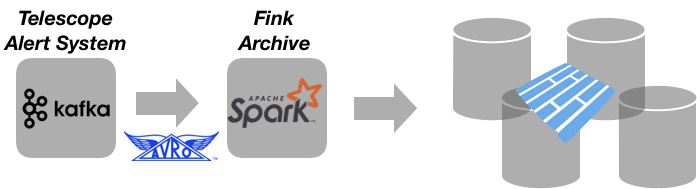

# Database

## Why archiving first?

If we had all our jobs reading from the upstream Kafka cluster, we would consume too much resources, and place high load on Kafka. Hence the first service of Fink is to archive the incoming streams, as fast as possible. We start with one Spark Structured Streaming job reading and decoding Avro events from telescopes, and writing them to partitioned Parquet tables in distributed file systems such as HDFS. Then multi-modal analytics take place and several other batch and streaming jobs query this table to process further the data, and other reports via interactive jobs, redirecting outputs to the dashboard.



## Database structure

We currently operates the conversion from Avro (alerts) to Parquet (database) for two reasons:

- Parquet is a built-in output sinks in Structured Streaming, not Avro. We can use a custom sink for Avro, but as Parquet is better integrated with the Spark ecosystem at this point, we stick to it for the moment.
- Other services (post-processing) integrates better with Parquet for the moment. Only the streaming out part would need re-conversion to Avro (Kafka style).

The archiving part is crucial, and must respect a number of criteria:

- The archiving must be done as quickly as possible.
- The archiving must resist to bursts of alerts.
- In case of several days of shut down, the archiving must be able to archive late data while ingesting new data.
- The database must be fault-tolerant, and must allow fast concurrent access.

Concerning the first 3 points, benchmarks and resources sizing are under study. For the last point, the main Parquet database is stored in HDFS, and data are partitioned hourly (`YYYY/MM/dd/hh`). We plan on having multiple copies of the data. To launch the archiving service, just use:

```bash
fink start archive > archiving.log &
```

Just make sure you attached the `archive` service to disks with large enough space! To define the location, see `conf/fink.conf`, or follow steps in [Configuration](configuration.md).

## Monitoring the data transfer

There is a monitoring service attached to the database construction. Unfortunately at the time of writing, there is no built-in listeners in pyspark (2.4) to monitor structured streaming queries. So we had to develop custom tools, and redirect information in the Fink [dashboard](dashboard.md). This is automatically done when you start the `archive` service. Just launch the Fink dashboard and go to `http://localhost:5000/live.html` to see the incoming rate and consumption (archiving) rate:

```bash
fink start dashboard
```

You can stop the archiving at anytime using:

```bash
fink stop archive
```

Note this will stop all Fink services running.
