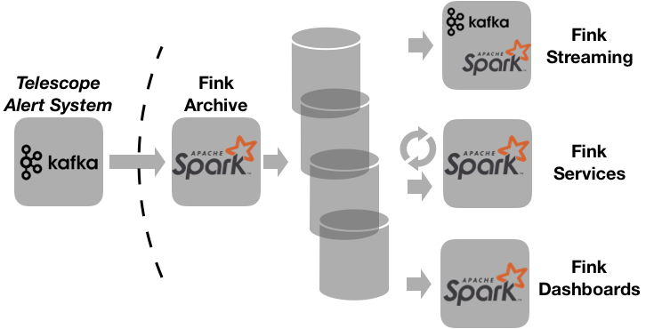

# Infrastructure

Fink decouples resources needed for listening to the stream (online, critical), and resources used for services: scalable, robust, and modular!



## Spark Structured streaming

Fink is principally based on the recent [Spark Structured Streaming](https://spark.apache.org/docs/latest/structured-streaming-programming-guide.html) module introduced in Spark 2.0 (see [paper](https://cs.stanford.edu/~matei/papers/2018/sigmod_structured_streaming.pdf)), and especially its integration with Apache Kafka (see [here](https://spark.apache.org/docs/latest/structured-streaming-kafka-integration.html)). Structured streaming is a stream processing engine built on the Spark SQL engine, hence it combines the best of the two worlds.
The idea behind it is to process data streams as a series of small batch jobs, called micro-batch processing. As anything in Spark, it provides fast, scalable, fault-tolerant processing, plus end-to-end exactly-once stream processing.

## Database

The most critical part in a context of big data is to capture as fast as possible the stream, and store information efficiently and reliably. We start with one Spark Structured Streaming job reading and decoding Avro events sent from telescopes, and writing them to partitioned Parquet tables in distributed file systems such as HDFS. The archiving part is crucial, and must pass a number of stress tests:

- The archiving must be done as quickly as possible (within seconds).
- The archiving must resist to bursts of alerts.
- In case of several days of shut down, the archiving must be able to archive late data while ingesting new data.
- The database must be fault-tolerant, and must allow fast concurrent access.

This main service is described in the [database](database.md) section.

## Services

### Services & dashboards

Fink provides built-in services, described in [Available Services](available-services.md). They operate at different timescales, and with various objectives:

- Operating from the stream or from the database
- Real time or post-processing of alerts.
- Urgent decision to take (observation plan).

Each service is Spark job on the database - either batch or streaming, or both (multi-modal analytics). All services are linked to the [dashboard](dashboard.md), and you can easily follow live and interactively the outputs. Note you can easily define your own service in Fink (i.e. your favourite ML code!), and connect it to the alert database. See [Adding a new service](adding-new-service.md) for more information.

### AstroLabNet

Full frontend for post-processing. WIP.

## Infrastructure for simulation

In Fink, we want also to test our services before deploying them full-scale. We provide a simple stream simulator based on a dockerized Kafka & Zookeeper cluster:

```bash
fink start simulator
```

This will set up the simulator and send a stream of alerts. Then test a service in simulation mode by specifying `--simulator`:

```bash
fink start <service> --simulator
```

See [Simulator](simulator.md) for more information.

## Streaming

The incoming stream will be also redirected outside for other brokers and individual clients. WIP
