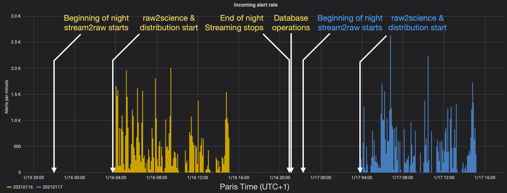
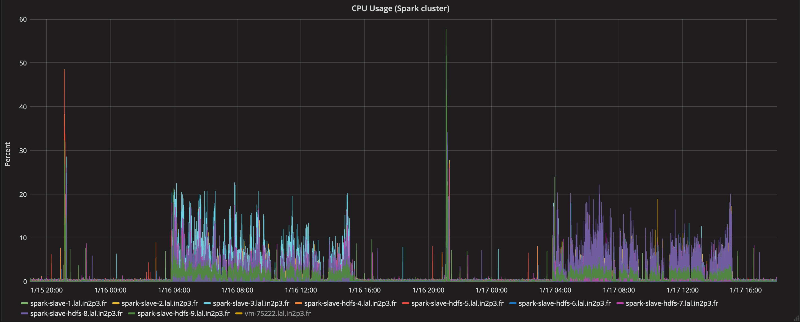

# Fink ZTF scheduler

Operations for the night N start at 9pm UTC on the night N-1. There are 2 cronjobs scheduled:

```bash
# Paris Time (UTC+1)
0 22 * * * /home/julien.peloton/fink-broker/launch_fink.sh
5 21 * * * /home/julien.peloton/fink-broker/database_service.sh
```

The first script is for live operations:

- `stream2raw`: Wrapped in `launch_fink.sh`. It listens to the ZTF stream, collect alerts, and store them on disks. Starts at 9pm UTC on night N-1.
- `raw2science`: Wrapped in `science_service.sh`. It loads collected alerts, processes them, and stores them on disks. It starts automatically when `stream2raw` collects alerts for the first time.
- `distribution`: Wrapped in `distribution_service.sh`. It loads processed alerts, splits into substreams (Kafka topics), and sends substreams to the Kafka cluster which will redirect alerts to users. It starts automatically when `raw2science` collects alerts for the first time.

All jobs stop at 8pm UTC on the night N. In addition there is one other cron job at the end of the night for database management (`database_service.sh`) that starts at 8.05pm UTC (just after streaming jobs end).


_Screenshot from the ZTF Grafana dashboard for the nights 20210116 and 20210117._


And here is the CPU usage for each machine of the Spark cluster @ VirtualData.


_Only a few cores are used per machine during broker operations (8 cores for stream2raw, 8 cores for raw2science, and 4 cores for the distribution. Database operations use 48 cores for the aggregation of data, and 18 cores for populating HBase)_
